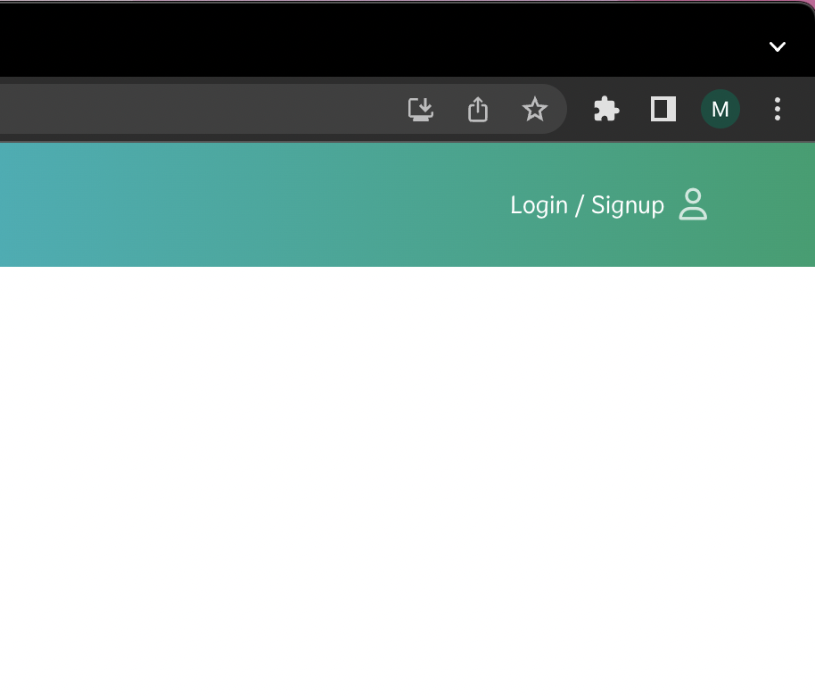
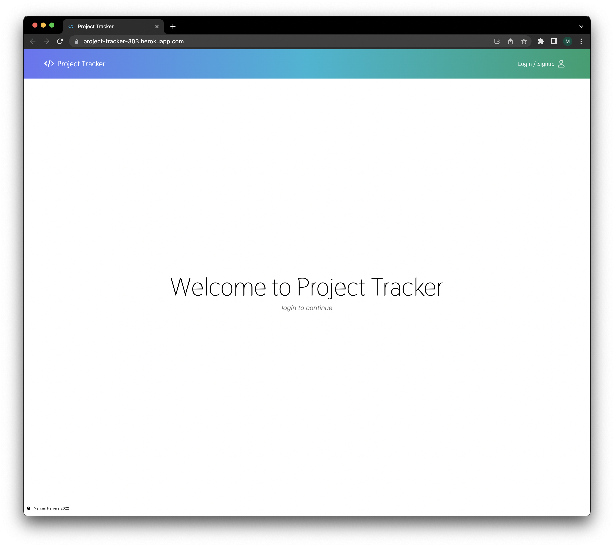
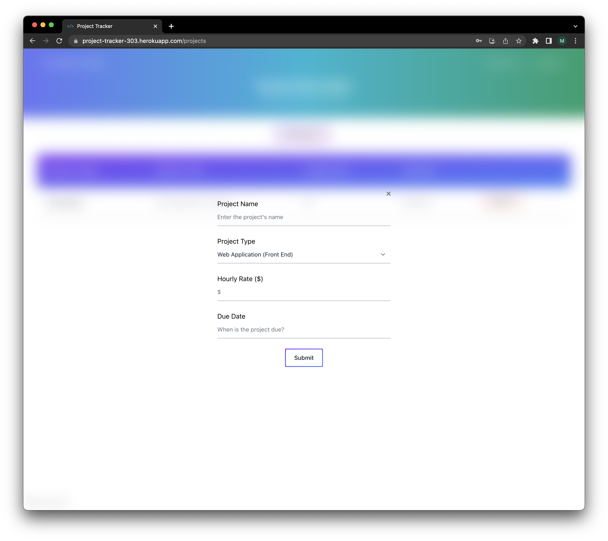
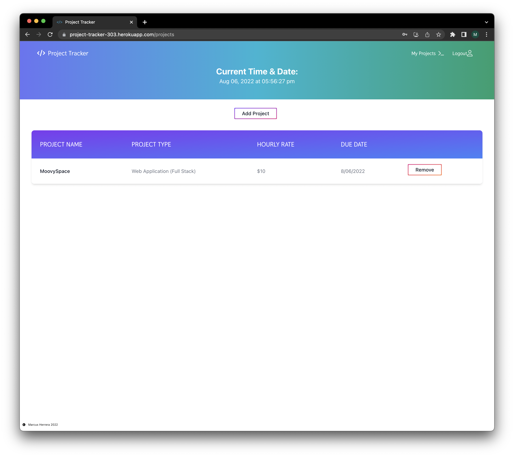

# Project Tracker

## Table of Contents

-   [Description](#description)
-   [Technologies](#technologies)
-   [Installation](#installation)
-   [Usage](#usage)
-   [Mock-Up](#mock-up)
-   [License](#license)
-   [Contributing](#contributing)
-   [Tests](#tests)
-   [Questions](#questions)

## Description

A React PWA to keep track of all your coding projects!

## Technologies

-   HTML5
-   CSS3
-   JavaScript
-   Node.js
-   Express.js
-   React
-   Tailwind
-   Flowbite
-   Apollo Server
-   MongoDB
-   GraphQl
-   DayJs

## Installation

Visit deployed link here: [Project Tracker](https://project-tracker-303.herokuapp.com/). Click on install icon in browser.

## Usage

Sign up or Login to access the projects page. Click the "Add Project" button to add a project. Simply click the "Remove" button to remove the project when you are finished with it.

## Mock-Up

## License

Permission is hereby granted, free of charge, to any person obtaining a copy of this software and associated
documentation files (the "Software"), to deal in the Software without restriction, including without limitation the rights
to use, copy, modify, merge, publish, distribute, sublicense, and/or sell copies of the Software, and to permit persons to
whom the Software is furnished to do so, subject to the following conditions:

The above copyright notice and this permission notice shall be included in all copies or substantial portions of the Software.

THE SOFTWARE IS PROVIDED "AS IS", WITHOUT WARRANTY OF ANY KIND, EXPRESS OR IMPLIED,
INCLUDING BUT NOT LIMITED TO THE WARRANTIES OF MERCHANTABILITY, FITNESS FOR A PARTICULAR
PURPOSE AND NONINFRINGEMENT. IN NO EVENT SHALL THE AUTHORS OR COPYRIGHT HOLDERS BE LIABLE
FOR ANY CLAIM, DAMAGES OR OTHER LIABILITY, WHETHER IN AN ACTION OF CONTRACT, TORT OR
OTHERWISE, ARISING FROM, OUT OF OR IN CONNECTION WITH THE SOFTWARE OR THE USE OR OTHER
DEALINGS IN THE SOFTWARE. See more here [MIT](https://opensource.org/licenses/MIT)

## Contributing

n/a

## Tests

n/a

## Questions

You can submit any questions to:

[GitHub](https://github.com/mahiv87)

maherreraiv1987@gmail.com
